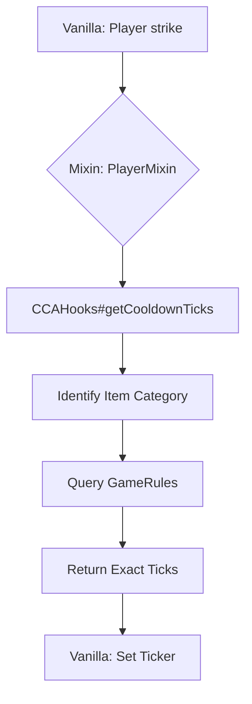

# 🏗️ Architecture: Combat Cooldown Adjuster

The mod follows the **Sovereign Standard** for Fabric modding, emphasizing modularity and minimal Mixin footprint.

## 🗺️ Logic Flow

### 1. Cooldown Override
Vanilla `Player#getCurrentItemAttackStrengthDelay` returns a value based on `Attributes.ATTACK_SPEED`. We inject at `HEAD` and redirect to `CCAHooks`.

### 2. Swap Agility
Vanilla `Player#resetAttackStrengthTicker` is called whenever `mainHandStack` changes. We inject at `HEAD` and conditionally `cancel()` the call.

- **Note**: To ensure normal attacks still reset the ticker, we implemented a custom hook `cca$resetOnlyAttackStrengthTicker` which bypasses our cancellation logic.

### 3. Combat Juice
Feedback is triggered in `Player#attack` before damage is applied. This ensures visual/audio feedback matches the *intent* of the strike.

---

## 📦 Component Roles

### `CombatRules` (Registry)
- Handles the lifecycle of `GameRules`.
- Provides type-safe accessors for `Level`.

### `CCAHooks` (Logic Provider)
- Pure static utility class.
- Contains all mathematical calculations, Tag checks, and Particle/Sound logic.
- **Rule**: No logic should exist in Mixins; Mixins only act as the bridge to `CCAHooks`.

### `PlayerMixin` (Bridge)
- Minimalist injection points.
- Shadows necessary vanilla fields (`attackStrengthTicker`).
- Redirects vanilla calls to `CCAHooks`.
