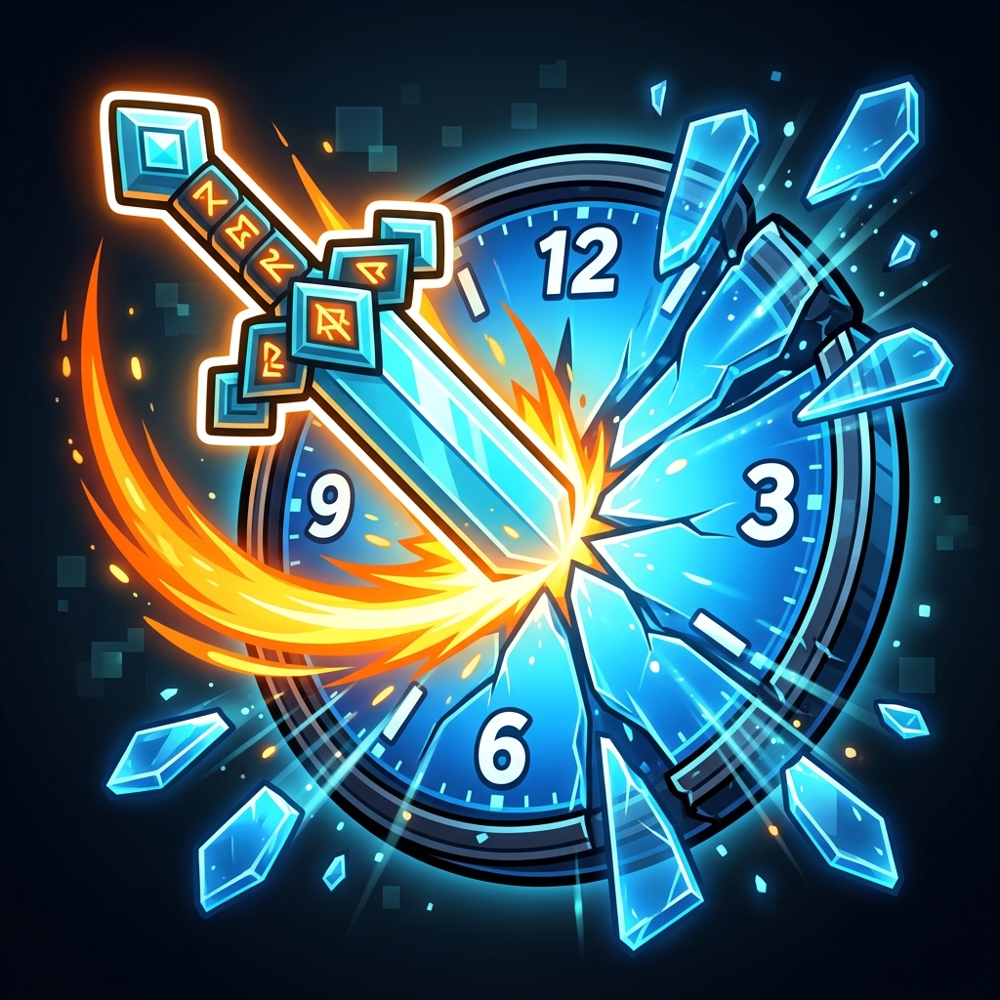

# Combat Cooldown Adjuster

> **"Respect the Player's Time, Not the Game's Rules."**

**Combat Cooldown Adjuster** is a premium utility mod for the **Instant Gratification Collection**. It reclaims the high-speed combat power fantasy by stripping away the artificial "wait-to-hit" friction of modern Minecraft.

## 🚀 Key Features

### 1. Categorical Tick Overrides
Total control over combat rhythm. Define exact tick durations for every major tool category:
- **Swords**: Fast, rhythmic strikes.
- **Axes**: Heavy, decisive blows.
- **Spears**: Long-reach, rapid thrusts.
- **Generic**: Customizable speed for fists and miscellaneous items.

### 2. Swap Agility
Switch items in your hotbar without losing your attack momentum. Perfect for rapid-fire weapon combos and tactical flexibility.

### 3. Combat Juice
Visual and auditory feedback that rewards high-speed play. Critical particles and pitch-shifted hit sounds create a satisfying "Combo" feel.

## ⚙️ Configuration (GameRules)

All settings are manageable in-game via **DasikLibrary** namespaced GameRules:

- `ig:sword_cooldown_ticks`: Default 4
- `ig:axe_cooldown_ticks`: Default 8
- `ig:spear_cooldown_ticks`: Default 6
- `ig:prevent_item_swap_cooldown`: Default true
- `ig:enable_combat_juice`: Default true

## 📦 Installation

1. Ensure you are running **Minecraft 26.x** (26.1.2+).
2. Install the latest **Fabric Loader**.
3. Drop the JAR into your `mods` folder along with **DasikLibrary**.

## 📜 License
This project is licensed under the **GPL v3 License**.

---
*Created by Dasik (Rifaditya)*
